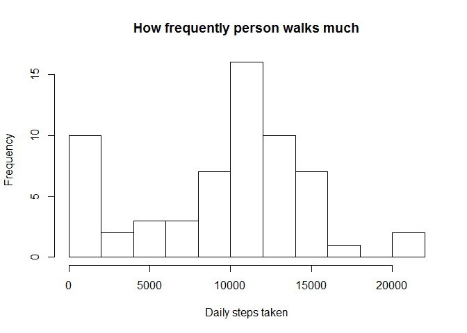
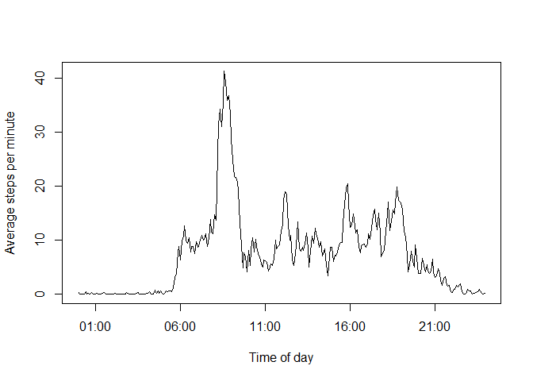

# Reproducible Research: Peer Assessment 1


## Loading and preprocessing the data

One problem with the dataset is that interval labels are presented as numbers,


```r
# Directory is custom for your computer, set it correctly
setwd("~/Coursera-R/RepData_PeerAssessment1/")

# Original Github branch has the data zipped, let's extract it
if(!file.exists("activity.csv")) unzip("activity.zip")

# read the file
data<-read.csv("activity.csv")

# We will need interval labels to read as actual time, so let's add a column
# But first, we should add make interval labels uniform
times<-sapply(
        data$interval,
        function(interval){
                paste0(
                        paste(
                                rep(0,4-nchar(as.character(interval))),
                                collapse=""),
                        interval)})
# times<-strptime(times,"%H%M")
names(times)<-"times"

# Now we can add times as time, let's have an additional column for that
tata<-cbind(data,times)
```

Was it a good idea to bind it at this step? Now all times entries have the same
current date, which is weird.

## What is mean total number of steps taken per day?


```r
sum<-tapply(data$steps,
            data$date,
            sum,
            na.rm=TRUE)
hist(sum,
     xlab="Daily steps taken",
     main="How frequently person walks much",
     breaks=10)
```

 

```r
summary(sum)
```

```
##    Min. 1st Qu.  Median    Mean 3rd Qu.    Max. 
##       0    6778   10400    9354   12810   21190
```


Mean is 9354, median is 10395
Hm...
Why median is different when called via summary() and directly via median()?


## What is the average daily activity pattern?

We collapse days by interval, and add zeroes to interval labels before making
the linear plot - to make x label meaningful, we need actual times of day there.


```r
pattern<-tapply(data$steps,
                data$interval,
                mean,
                na.rm=TRUE)
# If length of an interval label is less than 4, add zeroes at the start of the label
names(pattern)<-sapply(
        names(pattern),
        function(interval){
                paste0(
                        paste(
                                rep(0,4-nchar(as.character(interval))),
                                collapse=""),
                        interval)})

# Now that interval label are uniform, we can strptime() them to time of day
plot(strptime(names(pattern),
              "%H%M"),
     pattern/5,
     type="l",
     xlab="Time of day",
     ylab="Average steps per minute")
```

 

```r
which.max(pattern)
```

```
## 0835 
##  104
```

The most step usually happen in five minutes that start on 08:35


## Imputing missing values

Calculate the total number of missing values in the dataset

```r
sum(is.na(data))
```

```
## [1] 2304
```

Let's replace NAs with average value for the interval.


3.Create a new dataset that is equal to the original dataset but with the missing data filled in.


4.Make a histogram of the total number of steps taken each day and Calculate and report the mean and median total number of steps taken per day. Do these values differ from the estimates from the first part of the assignment? What is the impact of imputing missing data on the estimates of the total daily number of steps?


## Are there differences in activity patterns between weekdays and weekends?
