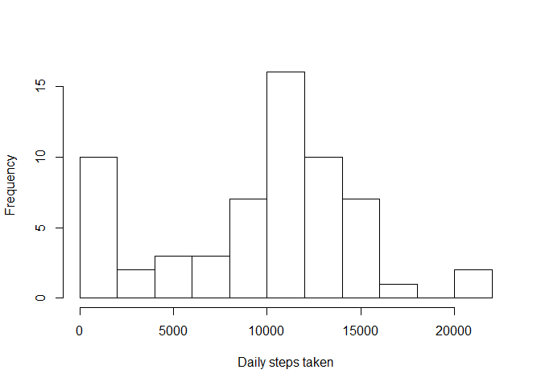

# Reproducible Research: Peer Assessment 1


## Loading and preprocessing the data


```r
# Directory is custom for your computer, set it correctly
setwd("~/Coursera-R/RepData_PeerAssessment1/")

# Original Github branch has the data zipped, let's extract it
if(!file.exists("activity.csv")) unzip("activity.zip")

# read the file
data<-read.csv("activity.csv")

# Later we will need to have intervals as actual time for charts,
# so let us make them uniform to ease strptime conversion
data$interval<-sapply(data$interval,
                      function(i){
                              i.length<-nchar(as.character(i))
                              if(i.length<4){
                                prefix<-paste(rep(0,4-i.length),collapse="")
                                paste0(prefix,i)}
                              else i
                              }
                      )
```

## What is mean total number of steps taken per day?


```r
sum<-tapply(data$steps,
            data$date,
            sum,
            na.rm=TRUE)
hist(sum,
     xlab="Daily steps taken",
     main="",
     breaks=10)
```

 

```r
summary(sum)
```

```
##    Min. 1st Qu.  Median    Mean 3rd Qu.    Max. 
##       0    6778   10400    9354   12810   21190
```


Mean is 9354, median is 10400.

## What is the average daily activity pattern?


```r
pattern<-tapply(data$steps,
                data$interval,
                mean,
                na.rm=TRUE)

plot(strptime(names(pattern),"%H%M"),
     pattern/5,
     type="l",
     xlab="Time of day",  
     ylab="Average steps per minute")
```

 

```r
which.max(pattern)
```

```
## 0835 
##  104
```

The most step usually happen in five minutes that start on
08:35.


## Imputing missing values

Calculate the total number of missing values in the dataset

```r
sum(is.na(data))
```

```
## [1] 2304
```

Let's replace NAs with average value for the interval and make a new dataset.


```r
d<-data
d$steps<-sapply(seq_along(d$steps),
                function(n){
                  if(is.na(d$steps[n])){
                          pattern[names(pattern)==d$interval[n]]
                  } else d$steps[n]
                  }
                  )
```


Now, if we rebuild the histogram, we should expect number of steps,
as well as median and mean, to go up.


```r
sum1<-tapply(d$steps,
            d$date,
            sum,
            na.rm=TRUE)
hist(sum1,
     xlab="Daily steps taken (with NAs replaced)",
     main="",
     breaks=10)
```

 

```r
summary(sum1)
```

```
##    Min. 1st Qu.  Median    Mean 3rd Qu.    Max. 
##      41    9819   10770   10770   12810   21190
```

And they did.


## Are there differences in activity patterns between weekdays and weekends?
